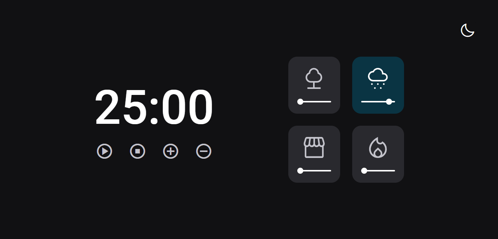

<h1 align="center">Focus Timer v2</h1>

[Projeto](#projeto) &nbsp;&nbsp;&nbsp;|&nbsp;&nbsp;&nbsp; [Tecnologias](#tecnologias)
&nbsp;&nbsp;&nbsp;|&nbsp;&nbsp;&nbsp; [Layout](#layout) &nbsp;&nbsp;&nbsp;|&nbsp;&nbsp;&nbsp;
[Licença](#license)

  

 

 
 

## 💻 Projeto 

Projeto criado durante o 4° Módulo do Stage 5 do Explorer, sendo ele, a 4° versão de um Timer estilo
pomodoro.

Objetivo dessa aplicação é utilizar do contador para realizar suas tarefas até o tempo acabar. A
aplicação conta com botões de controles, como adicionar e retirar 5 minutos, play, pause e stop, e
também audios de fundo.

Fortaleci meus conhecimentos de Factory, modularização, estruturação de dados, manipulação de DOM,
eventos e audios, prática de clean code, refatoração ,ES6 e aprendi a fazer data-set.

 
 

## 🚀 Tecnologias 

- HTML
- CSS
- JavaScript

 
 

## 🔖 Layout 

Você pode visualizar o layout do projeto através
[DESSE LINK](<https://www.figma.com/file/xFj5XaJhQm3W9eYIdEX7WR/Stage-05---Dark-Mode-FocusTimer-(Copy)?type=design&node-id=0%3A8&mode=design&t=SclzND96FncXatsT-1>).
É necessário ter conta no [Figma](https://figma.com) para acessá-lo.

 
 

## 🔒 Licença

Esse projeto está sob a licença MIT.

